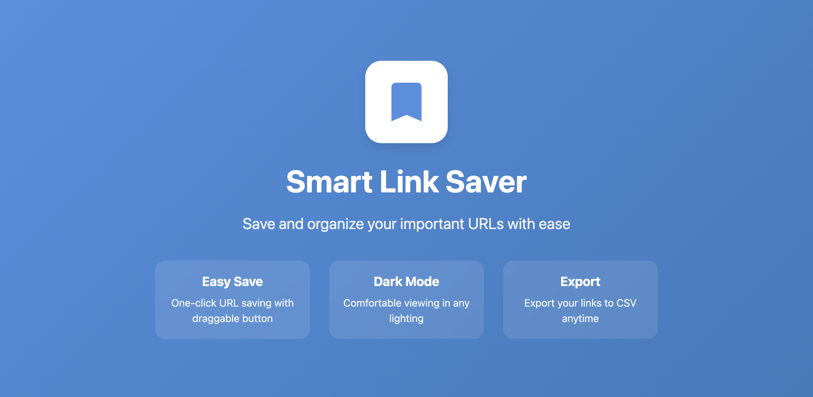

# Smart Link Saver

<div align="center">
  
</div>

A powerful Chrome extension for effortlessly saving and organizing your important URLs and search queries.


## 🌟 Features

### Easy URL Saving
- 📌 Draggable "Save URL" button on every webpage
- ✨ One-click saving functionality
- ✅ Instant visual feedback
- 🎯 Customizable button position

### Smart Organization
- 🔍 Search through saved links
- 🏷️ Filter between links and search queries
- 📅 Automatic timestamp tracking
- 🗂️ Clean, organized interface

### Export & Backup
- 📤 Export to CSV/Excel
- 💾 Local storage for privacy
- 🔄 Persistent across browser sessions
- 📋 Easy copy-paste functionality

### User Experience
- 🌓 Dark mode support
- 🎨 Modern, clean interface
- ⚡ Fast and responsive
- 🛡️ Privacy-focused

## 🚀 Installation

### From Chrome Web Store
1. Visit the [Chrome Web Store](your_chrome_web_store_link)
2. Click "Add to Chrome"
3. Confirm the installation

### For Development
1. Clone this repository:
```bash
git clone https://github.com/rakeshkodathala/smart-link-saver.git
```
2. Open Chrome and go to `chrome://extensions/`
3. Enable "Developer mode"
4. Click "Load unpacked"
5. Select the cloned repository folder

## 💻 Usage

1. **Saving Links**
   - Click the "Save URL" button on any webpage
   - The button can be dragged to any vertical position

2. **Managing Links**
   - Click the extension icon in toolbar
   - View all saved links
   - Search using the search bar
   - Filter using the type buttons

3. **Exporting Data**
   - Click "Export Links" in the popup
   - Choose save location for CSV file
   - Open with Excel or similar software

## 🛠️ Technical Details

### Built With
- HTML5
- CSS3
- JavaScript
- Chrome Extension APIs

### Permissions Used
- `storage` - For saving links locally
- `tabs` - For accessing current tab URL
- `activeTab` - For interacting with current page
- `clipboardRead` - For copy-paste functionality
- `scripting` - For save button injection
- `contextMenus` - For right-click options
- `notifications` - For user feedback
- `webNavigation` - For page load detection

## 🔒 Privacy

- All data stored locally
- No external servers used
- No personal data collected
- No analytics or tracking
- [Full Privacy Policy](https://rakeshkodathala.github.io/smart-link-saver/)

## 🤝 Contributing

Contributions are welcome! Please feel free to submit a Pull Request.

1. Fork the Project
2. Create your Feature Branch (`git checkout -b feature/AmazingFeature`)
3. Commit your Changes (`git commit -m 'Add some AmazingFeature'`)
4. Push to the Branch (`git push origin feature/AmazingFeature`)
5. Open a Pull Request

## 📝 License

Distributed under the MIT License. See `LICENSE` for more information.

## 📞 Contact

Rakesh Reddy - [rakeshreddy98666@email.com](mailto:rakeshreddy98666@email.com)

Project Link: [https://github.com/rakeshkodathala/smart-link-saver](https://github.com/yourusername/smart-link-saver)

## 🙏 Acknowledgments

- [Chrome Extension Documentation](https://developer.chrome.com/docs/extensions/)
- [Icons by FontAwesome](https://fontawesome.com/)
- All contributors and users

---

Made with ❤️ by Rakesh